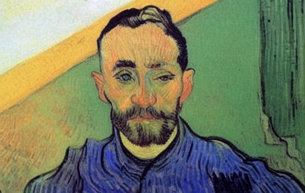

# Replicate img2img model in the style of Van Gogh



This is an img2img in the style of Van Gogh.
It was written in cog format to be push to replicate.com

### [Replicate version 3edc1fe]
This diffusion model was made from training 58 images of Van Gogh paintings (https://huggingface.co/hazwan/vg-session).
It is a mix of portrait and landscape.

This model does not look visually appealing because the original painting is more abstract compared to the Loving Vincent model below which trained on a movie that carefully made in the style of Van Gogh

### [Replicate version 76b7599]
The diffusion model is from https://huggingface.co/dallinmackay/Van-Gogh-diffusion

cog.yaml specify the dependencies and python libraries

predict.py is to consume input (image and prompt) and run the input through the diffusion model

&nbsp;

## Cog process

To initialize the directory
```
cog init
```
&nbsp;

To build locally and do inference to the image balloon.jpg
```
cog predict -i prompt="vangh, man" -i image=@imgs/man_1.jpg"
```
&nbsp;

Next add credential and push the build to replicate.com
```
cog login
cog push r8.im/hazxone/img2img-vg
```


&nbsp;

## Inference process

Head over to https://replicate.com/hazxone/img2img-vg to try the web demo

&nbsp;

For the 3edc1fe model, use 'vangh' as the trigger word

&nbsp;

For the 76b7599 model, the author suggested to use 'lvngvncnt' in the begging of the prompt.

&nbsp;

Or use the python replicate_api.py to infer using API
