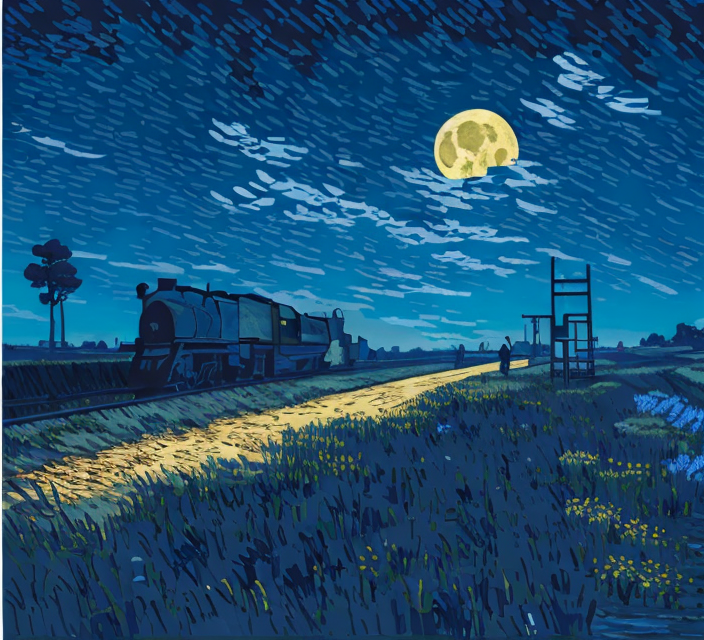

# Replicate img2img model in the style of Van Gogh



This is an img2img in the style of Van Gogh.
It was written in cog format to be push to replicate.com

The diffusion model is from https://huggingface.co/dallinmackay/Van-Gogh-diffusion

cog.yaml specify the dependencies and python libraries

predict.py is to consume input (image and prompt) and run the input through the diffusion model

&nbsp;

## Cog process

To initialize the directory
```
cog init
```
&nbsp;

To build locally and do inference to the image balloon.jpg
```
cog predict -i prompt="lvngvncnt, a kid holding a balloon" -i image=@balloon.jpg"
```
&nbsp;

Next add credential and push the build to replicate.com
```
cog login
cog push r8.im/hazxone/img2img-vg
```


&nbsp;

## Inference process

Head over to https://replicate.com/hazxone/img2img-vg to try the web demo

For this Van Gogh model, the author suggested to use 'lvngvncnt' in the begging of the prompt.

Or use the python replicate_api.py to infer using API
